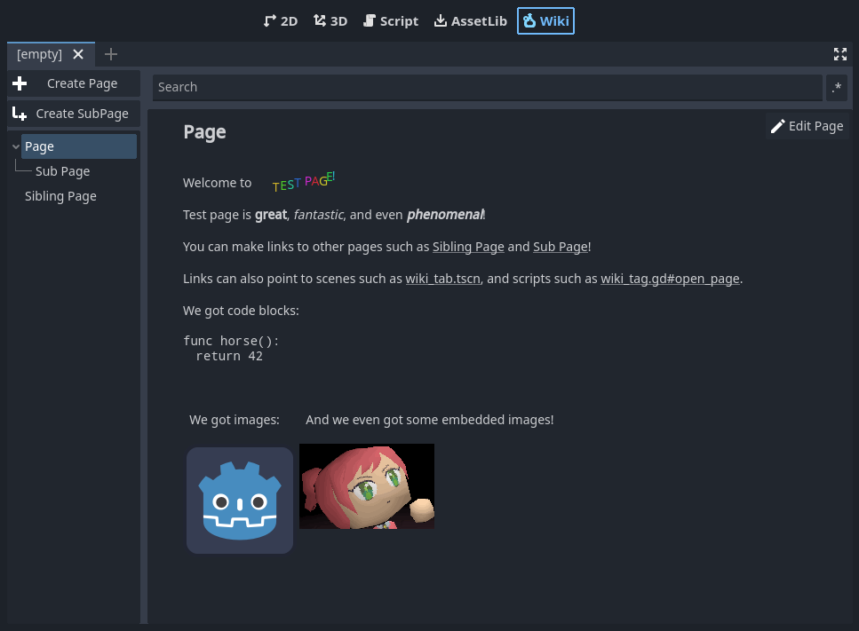
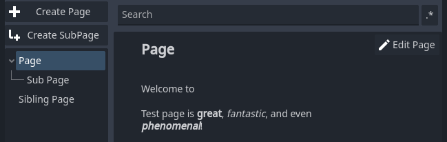
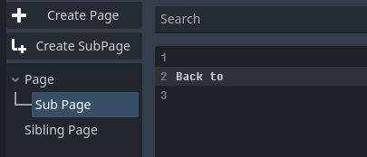
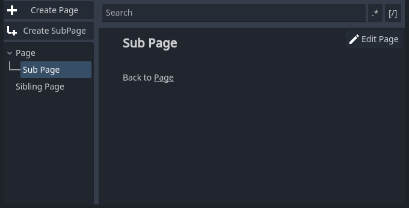

# Cider Wiki

This Godot plugin adds a Wiki tab to the editor,
which allows you to create and edit project documentation
without leaving the editor.

The pages are arranged in a tree structure,
each page consisting of a BBCode document.
Pages may contain links to other pages,
as well as to other files in the project.

When a page has a link to a scene or script file,
clicking that link will open that scene/script for editing.
Other file types will simply be highlighted in the FileSystem panel.

## Installation

Simply copy this project's `addons` folder into your project.

When you create your first page, a `cider_wiki_pages` directory will be created
in your project. This directory won't be visible in Godot, but make sure to
commit it with your code! Treat it as you would any other documentation files.

## Editing pages

To edit a page, open that page in the Wiki view and click the Edit button in
the top-right corner.

Pages use Godot's RichTextLabel BBCode format. A reference can be found
[here][bbcode].

Additionally, Cider uses double-braced extension tags like `[[this]]` to insert
special elements, such as links to other pages.

Here are all the supported extension tags:

| Syntax              | Effect
|:--------------------|:--
| `[[Cool Page]]`     | Creates a link to another page under the same parent as the current page.
| `[[>Cool SubPage]]` | Creates a link to a sub-page of this one.
| `[[/Path/To/Page]]` | Creates a link to a page with an absolute path.
| `[[page:As Above]]` | Same as any other page link, the `path:` part is simply optional.
| `[[img:img_1.png]]` | Displays an embedded image (see below).

### Page links to non-existing pages

When you click on a link to a page that doesn't exist, you'll be prompted to
create it. This allows you to create a link to a page that you know you'll
want to make in the future, without interrupting your editing flow.

### Pasting images

Images can be pasted directly from your clipboard into the page's BBCode.
This will save the image to the page's data,
and create an `[[img:]]` tag for you.

Embedded images will not be automatically deleted if you remove the tag.
If you want to delete the image, you'll need to do so manually from the
page's embedded `_images` directory.

> [!TIP]
> To display other, non-embedded images, use the plain BBCode `[img]` tag.

### URL links to project files

You can create `res://` links such as `[url]res://main_menu.tscn[/url]` to
link to a file in the project.

The type of file affects the behavior when clicked.

If the file is a scene (`.tscn` or `.scn`), it will be opened in the scene
view. Also, if the url contains a `#fragment`, the node specified by the
fragment will be selected in the node tree after the scene is opened.
Example: `[url]res://main_menu.tscn#/PlayerCharacter[/url]`

If the file is a script (`*.gd`), it will be opened in the script editor.
Also, if the url contains a `#fragment`, the script editor will jump
to the line number or a class member specified bt the fragment.
Example: `[url]res://player_character.gd#_process[/url]`

Otherwise, for any other file type, the file will be selected in the
FileSystem panel.

### Drag-n-drop

Scene nodes, FileSystem files, and Wiki pages can all be drag-n-dropped into
a page's BBCode. The appropriate tag or link will be created.

Images dragged in from the FileSystem will create `[img]` tags to display the
image, instead of creating the `[url]` tag that other resources do.

## Moving, renaming, and deleting pages

> [!IMPORTANT]
> Links to a page are not automatically updated when the page is moved/renamed!

Pages can be moved by dragging them onto another page in the tree
(this other page will become the dragged page's new parent).

Right-clicking a page will open a popup menu to rename or delete the page.

Deleted pages are sent to your operating system's Recycle Bin.

### Searching

The search bar can be used to find text in all pages.
Double-clicking a result will take you to it.

Normally, the search will look for literal matches to the input,
case insensitive.

Toggling the `.*` button to the right of the search input will enable/disable
regular expression syntax in the input. This uses Godot's [RegEx][godot-regex]
class to search files, full reference [here][pcre2-reference]. The regex will
automatically be prefixed with the flags `(?im)` (case-insensitive, multiline).
To disable these, you can use `(?^)` or `(?-i)` at the start of your search.

Toggling the `[/]` button will search the raw BBCode of the page instead of the
rendered output. Double-clicking a result will take you to that line in the
BBCode editor instead of showing the rendered page.

## Page data structure

Each page is represented by a directory in the `cider_wiki_pages` directory.

Within a page's directory, there will be a `.txt` file sharing the same name.
This file is a simple text file contianing the BBCode document.

Additionally, each page may have an `_images` directory, which contains any
embedded images which were pasted into the document.

Sub-pages are stored within their parent page's directory.

> [!IMPORTANT]
> Make sure to commit and backup the entire `cider_wiki_pages` directory!

## Configuration

There really isn't much to configure.

If desired, you can change the `cider_wiki_pages` directory name and location
by editing `addons/cider_wiki/wiki_tab.gd`. At the top, set the `DATA_DIR`
constant to your desired location.

[bbcode]: https://docs.godotengine.org/en/stable/tutorials/ui/bbcode_in_richtextlabel.html#reference
[godot-regex]: https://docs.godotengine.org/en/stable/classes/class_regex.html
[pcre2-reference]: https://www.pcre.org/current/doc/html/pcre2pattern.html
